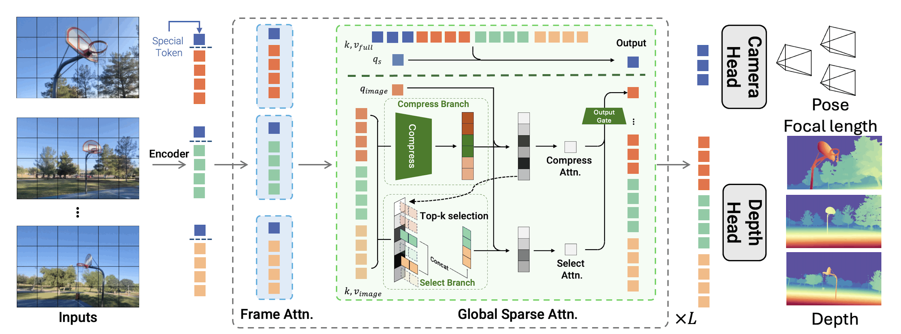

<h1 align="center">Speed3R: <u>Sp</u>arse F<u>eed</u>-forward 3D Reconstruction Models</h1>

<div align="center">
    <p>
        <a href="https://github.com/rwn17">Weining Ren</a><sup>1</sup>&nbsp;&nbsp;
        <a href="https://tanxchong.github.io/">Xiao Tan</a><sup>2</sup>&nbsp;&nbsp;
        <a href="https://www.kaihan.org/">Kai Han</a><sup>1</sup>&nbsp;&nbsp;
    </p>
    <p>
        <sup>1</sup>The University of Hong Kong &nbsp;&nbsp;&nbsp;
        <sup>2</sup>Baidu AMU &nbsp;&nbsp;&nbsp;
    </p>
</div>

<p align="center">
    <a href="https://arxiv.org/abs/2603.08055" target="_blank">
    
    </a>
    <a href="https://visual-ai.github.io/speed3r/" target="_blank">
    
    </a>
      <a href="https://huggingface.co/weining17/Speed3R_Pi3">
    
  </a>
</p>

<div align="center">
    <a href="[PROJECT_PAGE_LINK_HERE]">
        
    </a>
    <p>
        <i>Speed3R accelerate VGGT and &pi;³ with trainable sparse attention</i>
    </p>
</div>


## 📣 Updates
* **[March 6, 2026]** Initial Release


## ✨ Overview
While recent feed-forward 3D reconstruction models accelerate 3D reconstruction by jointly inferring dense geometry and camera poses in a single pass, their reliance on dense attention imposes a quadratic complexity, creating a computational bottleneck that severely limits inference speed. 

To resolve this, we introduce Speed3R, an end-to-end trainable model inspired by the core principle of Structure-from-Motion that a sparse set of keypoints is sufficient for robust estimation. Speed3R features a dual-branch attention mechanism where the compression branch creates a coarse contextual prior to guide the selection branch, which performs fine-grained attention only on the most informative image tokens. This strategy mimics the efficiency of traditional keypoint matching, achieving a remarkable 12.4x inference speedup on 1000-view sequences, while introducing a minimal, controlled trade-off in accuracy. Validated on standard benchmarks with both VGGT and &pi;³ backbones, our method delivers high-quality reconstructions at a fraction of computational cost, paving the way for efficient large-scale scene modeling.


## 🚀 Quick Start

### 1. Clone & Install Dependencies
First, clone the repository and install the required packages.
```bash
git clone https://github.com/Visual-AI/speed3r.git
cd speed3r
pip install -r requirements.txt
pip install triton==3.3.1
```

### 2\. Run Inference from Command Line

Try our example inference script. You can run it on a directory of images or a video file.

If the automatic download from Hugging Face is slow, you can download the model checkpoint manually from [Speed3R_Pi3](https://huggingface.co/weining17/Speed3R_Pi3/tree/main/model.safetensors) and specify its local path using the `--ckpt` argument.

```bash
# Run with the default example video
python example.py
```

### 3\. Run with Gradio Demo

You can also launch a local Gradio demo for an interactive experience.

```bash
# Install demo-specific requirements
pip install -r requirements_demo.txt

# Launch the demo
python demo_gradio.py
```


## 🛠️ Detailed Usage

### Model Input & Output

The model takes a tensor of images and outputs a dictionary containing the reconstructed geometry.

  * **Input**: A `torch.Tensor` of shape $B \times N \times 3 \times H \times W$ with pixel values in the range `[0, 1]`.
  * **Output**: A `dict` with the following keys:
      * `points`: Global point cloud unprojected by `local points` and `camerae_poses` (`torch.Tensor`, $B \times N \times H \times W \times 3$).
      * `local_points`: Per-view local point maps (`torch.Tensor`,  $B \times N \times H \times W \times 3$).
      * `conf`: Confidence scores for local points (Raw confidence logits. Apply `torch.sigmoid()` to obtain probabilities in `[0, 1]`, higher is better) (`torch.Tensor`,  $B \times N \times H \times W \times 1$).
      * `camera_poses`: Camera-to-world transformation matrices (`4x4` in OpenCV format) (`torch.Tensor`,  $B \times N \times 4 \times 4$).

### Example Code Snippet

Here is a minimal example of how to run the model on a batch of images.

```python
import torch
from pi3.models.pi3_sparse import Pi3_Sparse
from pi3.utils.basic import load_images_as_tensor # Assuming you have a helper function

# --- Setup ---
device = 'cuda' if torch.cuda.is_available() else 'cpu'
model = Pi3_Sparse.from_pretrained("weining17/Speed3R_Pi3").to(device).eval()
# or download checkpoints from `https://huggingface.co/weining17/Speed3R_Pi3/tree/main/model.safetensors`

# --- Load Data ---
# Load a sequence of N images into a tensor
# imgs shape: (N, 3, H, W).
# imgs value: [0, 1]
imgs = load_images_as_tensor('path/to/your/data', interval=10).to(device)

# --- Inference ---
print("Running model inference...")
# Use mixed precision for better performance on compatible GPUs
dtype = torch.bfloat16 if torch.cuda.is_available() and torch.cuda.get_device_capability()[0] >= 8 else torch.float16

with torch.no_grad():
    with torch.amp.autocast('cuda', dtype=dtype):
        # Add a batch dimension -> (1, N, 3, H, W)
        results = model(imgs[None])

print("Reconstruction complete!")
# Access outputs: results['points'], results['camera_poses'] and results['local_points'].
```

## TODOs
- [ ] Release Speed3R-VGGT code & ckpt
- [ ] Release the training 

## Notice
1. Currently, the model only supports resolutions that are multiples of 56 rather than 14.
2. We test the method with triton version 3.3.1, lower version may cause numerical error.
3. Curently the kernel only support bf16/fp16.


## 🙏 Acknowledgements

Our work builds upon several fantastic open-source projects. We'd like to express our gratitude to the authors of:

  * [DUSt3R](https://github.com/naver/dust3r)
  * [CUT3R](https://github.com/CUT3R/CUT3R)
  * [VGGT](https://github.com/facebookresearch/vggt)
  * [Pi3](https://yyfz.github.io/pi3/)
  * [NSA](https://arxiv.org/abs/2502.11089)
  * [NSA Implementation](https://github.com/XunhaoLai/native-sparse-attention-triton)


## Excellent Concurrent Works Accelerating VGGT
  * [FastVGGT](https://github.com/mystorm16/FastVGGT)
  * [FasterVGGT](https://github.com/brianwang00001/sparse-vggt)
  * [FlashVGGT](https://arxiv.org/abs/2512.04939)
  * [CO-Me](https://co-me-tokens.github.io/)
  * [AVGGT](https://arxiv.org/abs/2512.02541)
  * [LiteVGGT](https://arxiv.org/pdf/2512.21691)
  * [Attetion Collapse Analysis](https://arxiv.org/pdf/2512.21691)


## 📜 Citation

If you find our work useful, please consider citing:

```bibtex
@article{ren2026speed3r,
    title={Speed3R: Sparse Feed-forward 3D Reconstruction Models},
    author={Ren, Weining and Tan, Xiao and Han, Kai},
    journal={arXiv preprint arXiv:xxxxxxx},
    year={2026}
}
```


## 📄 License
This project adopts a dual-licensing strategy following Pi3:

| Component | License | Commercial Use |
| :--- | :--- | :--- |
| **Code** (Scripts, Tools, Logic) | [BSD 3-Clause](LICENSE) | **Permitted** |
| **Model Weights** (Pi3 Weights) | [CC BY-NC 4.0](https://creativecommons.org/licenses/by-nc/4.0/) | **Strictly Non-Commercial** |

**Note on Model Weights:** Due to the nature of the training datasets, the model weights are restricted to non-commercial research and educational purposes only. Redistribution of the weights must maintain this restriction.
